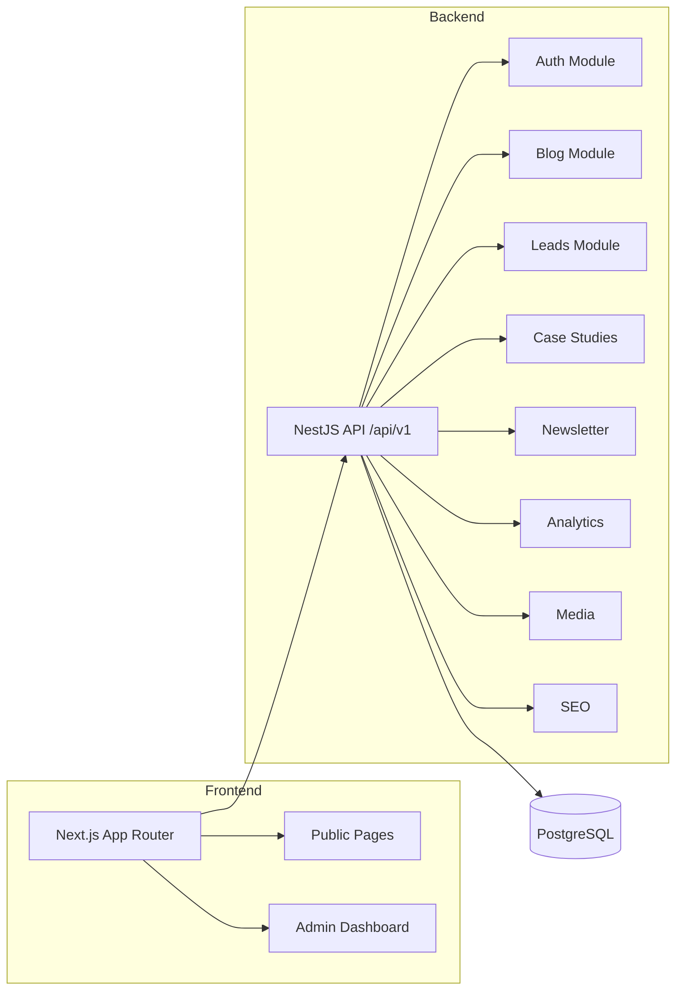

# Defnix — Engineering Studio Platform

> SOC2 Compliance · Cloud Security · AI-Driven Security Operations

Production-grade platform for an engineering studio specializing in SOC2 failure prevention, cloud risk engineering, and AI-augmented security operations. Built for lead generation, technical authority building, and future SaaS module integration.

## Architecture

```
Defnix/
├── frontend/          → Next.js 16 (App Router, TypeScript)
├── backend/           → NestJS (TypeScript, modular monolith)
├── database/          → PostgreSQL migrations
├── docker-compose.yml → Local dev PostgreSQL + Redis
└── .github/workflows/ → CI pipeline
```



## Tech Stack

| Layer | Technology |
|-------|-----------|
| Frontend | Next.js 16, TypeScript, TailwindCSS, Framer Motion, Lucide Icons |
| Backend | NestJS, TypeORM, class-validator, Passport JWT, Helmet |
| Database | PostgreSQL 16 |
| Fonts | Sora, DM Sans, IBM Plex Sans, JetBrains Mono |
| CI/CD | GitHub Actions |

## Prerequisites

- **Node.js** 20+
- **PostgreSQL** 16+ (local install or Docker)
- **npm** 10+

## Quick Start

### 1. Clone & Install

```bash
git clone <repo-url> && cd Defnix
cd backend && npm install
cd ../frontend && npm install
```

### 2. Database Setup

**Option A — Docker** (recommended):
```bash
docker compose up -d postgres
```

**Option B — Native PostgreSQL:**
```sql
CREATE USER defnix WITH PASSWORD 'defnix_dev';
CREATE DATABASE defnix OWNER defnix;
```

### 3. Environment Configuration

```bash
# Backend
cp backend/.env.example backend/.env
# Edit backend/.env with your DB credentials

# Frontend
cp frontend/.env.example frontend/.env.local
```

### 4. Start Development Servers

```bash
# Terminal 1 — Backend (port 3001)
cd backend && npm run start:dev

# Terminal 2 — Frontend (port 3000)
cd frontend && npm run dev
```

The backend will auto-create tables via TypeORM `synchronize: true` on first run.

### 5. Create Admin User

```bash
cd backend
npx ts-node -P tsconfig.json scripts/create-admin.ts
```

Default credentials: `admin@defnix.com` / `Admin@123`

### 6. Seed Blog Content (Optional)

```bash
cd backend
npx ts-node -P tsconfig.json scripts/seed-blog.ts
```

Seeds 3 technically accurate articles, tags, categories, and an author.

## API Reference

All endpoints are prefixed with `/api/v1`.

### Public Endpoints

| Method | Path | Description |
|--------|------|-------------|
| `GET` | `/blog/posts` | List published posts (paginated) |
| `GET` | `/blog/posts/:slug` | Get post by slug |
| `GET` | `/blog/search?q=` | Full-text search |
| `GET` | `/blog/tags` | List all tags |
| `GET` | `/blog/categories` | List all categories |
| `GET` | `/case-studies` | List case studies |
| `GET` | `/case-studies/:slug` | Get case study by slug |
| `POST` | `/leads` | Submit contact form |
| `POST` | `/newsletter/subscribe` | Subscribe email |
| `POST` | `/analytics/events` | Track custom event |
| `GET` | `/seo/sitemap.xml` | Dynamic XML sitemap |
| `GET` | `/seo/robots.txt` | Robots.txt |

### Admin Endpoints (JWT Required)

| Method | Path | Description |
|--------|------|-------------|
| `POST` | `/auth/login` | Admin login → JWT |
| `GET` | `/blog/admin/posts` | List all posts (any status) |
| `POST` | `/blog/posts` | Create post |
| `PUT` | `/blog/posts/:id` | Update post |
| `DELETE` | `/blog/posts/:id` | Delete post |
| `GET` | `/leads` | List all leads |
| `PATCH` | `/leads/:id/status` | Update lead status |
| `POST` | `/case-studies` | Create case study |
| `PUT` | `/case-studies/:id` | Update case study |
| `DELETE` | `/case-studies/:id` | Delete case study |
| `GET` | `/newsletter/subscribers` | List subscribers |
| `DELETE` | `/newsletter/unsubscribe` | Unsubscribe |
| `GET` | `/analytics/events` | List events |
| `GET` | `/analytics/summary` | Event summary |
| `POST` | `/media/upload` | Upload media file |
| `GET` | `/media` | List media assets |
| `DELETE` | `/media/:id` | Delete media asset |

### Authentication

```bash
# Login
curl -X POST http://localhost:3001/api/v1/auth/login \
  -H "Content-Type: application/json" \
  -d '{"email":"admin@defnix.com","password":"Admin@123"}'

# Use the returned token
curl http://localhost:3001/api/v1/leads \
  -H "Authorization: Bearer <accessToken>"
```

## Deployment

### Frontend → Vercel

1. Connect the repo to Vercel
2. Set root directory to `frontend`
3. Set environment variable: `NEXT_PUBLIC_API_URL=https://api.defnix.com/api/v1`
4. Deploy

### Backend → AWS ECS / EC2

1. Build the Docker image:
   ```bash
   cd backend && docker build -t defnix-api .
   ```
2. Push to ECR and deploy via ECS, or run directly on EC2
3. Set all environment variables from `.env.example`
4. Ensure PostgreSQL is accessible (AWS RDS recommended for production)

### Database → AWS RDS

- Engine: PostgreSQL 16
- Instance: `db.t3.micro` (dev) / `db.t3.medium` (prod)
- Enable automated backups and encryption at rest

## Project Structure

```
frontend/src/
├── app/                  → Pages (App Router)
│   ├── admin/            → Admin dashboard (protected)
│   ├── blog/             → Blog listing + detail
│   ├── case-studies/     → Case studies
│   ├── solutions/        → Solution detail pages
│   ├── about/            → About page
│   ├── contact/          → Contact form
│   ├── privacy-policy/   → Legal
│   ├── terms-of-service/ → Legal
│   └── disclaimer/       → Legal
├── components/
│   ├── layout/           → Header, Footer, LayoutContent
│   ├── sections/         → Hero, Solutions, Metrics, CTA, etc.
│   └── ui/               → Button, PageTransition
└── lib/
    ├── api.ts            → API client (fetchApi, fetchApiAuth)
    └── auth.tsx          → AuthProvider context

backend/src/
├── modules/
│   ├── auth/             → JWT login, guards
│   ├── blog/             → Posts, tags, categories, authors
│   ├── leads/            → Contact form submissions
│   ├── case-studies/     → Case study CRUD
│   ├── newsletter/       → Subscriber management
│   ├── analytics/        → Event tracking
│   ├── media/            → File uploads
│   └── seo/              → Sitemap, robots.txt
├── main.ts               → App bootstrap
└── app.module.ts         → Root module
```

## License

Proprietary — Defnix Engineering © 2026
